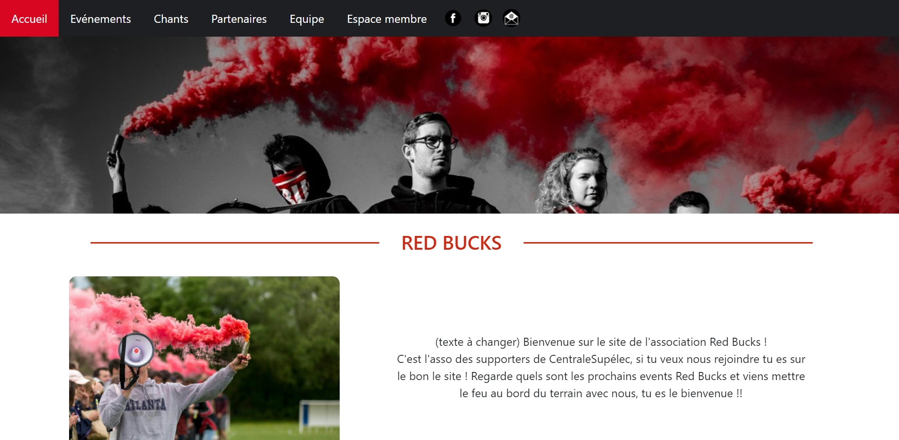
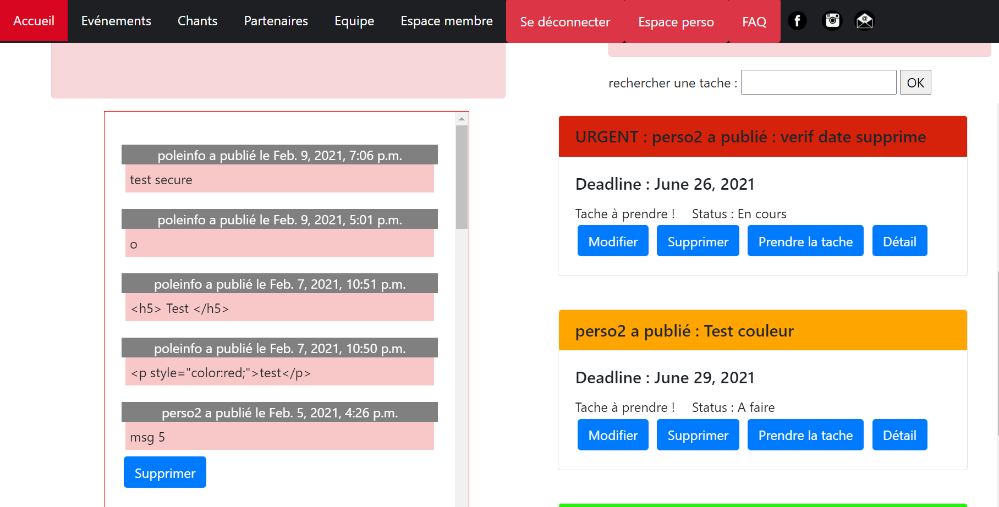
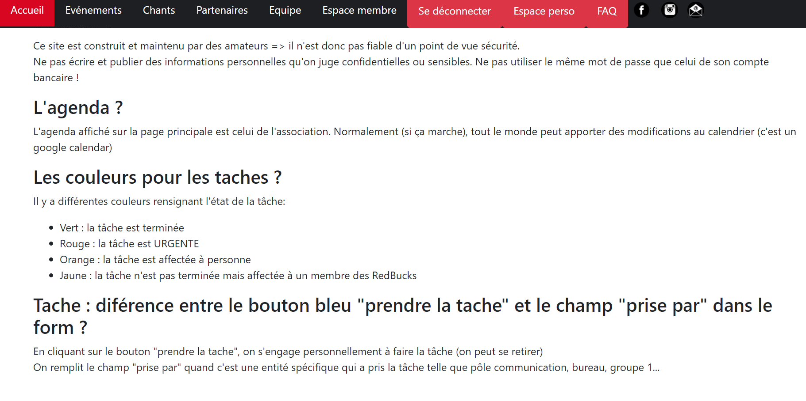

# Site red bucks (club des supporters de CS)
Par Julien Jacquot

### L'association
L'association RedBucks est l'association des supporters de CentraleSupélec. Après deux ans de silence, l'association est de retour pour mettre l'ambiance autour des terrains.

&nbsp;

### Description du site web

Ce site a deux utilités principales: 
  
1/ Faire office de site vitrine pour promouvoir la nouvelle association des suporters au sein du campus.  
2/ Faire office de mini ERP pour que les membres de l'association puissent s'organiser

### Site vitrine

Cette partie est faite pour présenter l'association, avec les pages : accueil, l'équipe, les chants, les partenaires et les évènements. Ces pages sont simplement codées en HTML/CSS et javascript.
 

### Mini ERP

Cette partie est accessible en s'authentifiant (pour l'instant, **username : perso2 et password: verification34**). Une base de donnée reliée à cette partie permet à l'utilisateur de créer/supprimer des tâches, de prendre en charge une tache ou simplement consulter les tâches de l'association. Les tâches dont leur deadline est dépassée d'une semaine est automatiquement supprimée.
  
 Un système de jeu de couleur est mis en place pour afficher les taches avec une couleur en lien avec le degré d'urgence de la tâche.
  

De plus, l'utilisateur peut publier des messages ou remarques pour partager des informations avec le reste de l'association. 
Enfin, un google calendar est intégrée à la page membre pour que les évnèments importants de l'association soient enregistrés et visibles par tous.
  
Une page FAQ est disponible pour répondre aux questions récurrentes posées au sujet de l'utilisation du site.
 

 
Une page perso est disponible pour que chaque membre puisse voir toutes les taches pour lesquelles il s'est engagé. 

